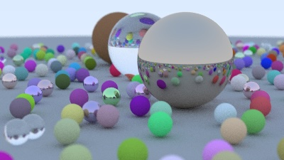

This repo is yet-another Rust implementation of [Ray Tracing in One Weekend](https://raytracing.github.io/books/RayTracingInOneWeekend.html).

Following and transforming the C++ code was a learning experience as a first Rust deep-dive.

To run:
```
cargo run > image.ppm
```
This will generate `./image.ppm` with the rendered scene.

Generated images during the developing process can be found [here](https://github.com/NachoMG/raytracer/tree/master/images).

Final result:

